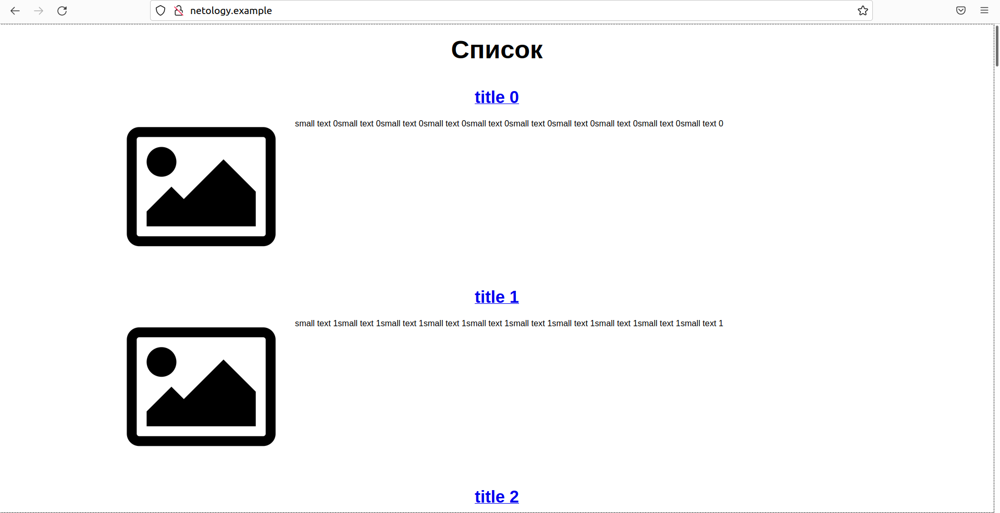

**1. Задача №1**

Ссылка на [манифесты](https://github.com/Perovss/netology/tree/master/task13.1/1)

Pods
<pre><b>serge@Lenovo</b>:<b>~/netology/task13.1</b>$ kubectl get pods -n stage
NAME                                READY   STATUS    RESTARTS   AGE
db-0                                1/1     Running   0          8m9s
frontend-backend-566c78d477-m5sdz   2/2     Running   0          8m8s
</pre>

Deployment

<pre><b>serge@Lenovo</b>:<b>~/netology/task13.1</b>$ kubectl get deployment -n stage
NAME               READY   UP-TO-DATE   AVAILABLE   AGE
frontend-backend   1/1     1            1           9m29s
</pre>

StatefulSet

<pre><b>serge@Lenovo</b>:<b>~/netology/task13.1</b>$ kubectl get statefulset -n stage
NAME   READY   AGE
db     1/1     10m
</pre>

Service
<pre><b>serge@Lenovo</b>:<b>~/netology/task13.1</b>$ kubectl get service -n stage
NAME       TYPE        CLUSTER-IP       EXTERNAL-IP   PORT(S)    AGE
db         ClusterIP   10.103.189.234   &lt;none&gt;        5432/TCP   10m
frontend   ClusterIP   10.111.147.224   &lt;none&gt;        8000/TCP   10m
</pre>

**2. Задача №2**

Ссылка на [манифест](https://github.com/Perovss/netology/tree/master/task13.1/2)

Pods

<pre><b>serge@Lenovo</b>:<b>~/netology/task13.1</b>$ kubectl get pods -n product 
NAME                        READY   STATUS    RESTARTS   AGE
backend-68f7d9dc55-pgf8c    1/1     Running   0          75s
backend-68f7d9dc55-tkbg4    1/1     Running   0          75s
backend-68f7d9dc55-wlphv    1/1     Running   0          75s
db-0                        1/1     Running   0          77s
frontend-5cf457b7d8-62nrl   1/1     Running   0          16s
frontend-5cf457b7d8-bndsm   1/1     Running   0          16s
frontend-5cf457b7d8-l9jdf   1/1     Running   0          75s
</pre>

StatefulSet

<pre><b>serge@Lenovo</b>:<b>~/netology/task13.1</b>$ kubectl get statefulset -n product 
NAME   READY   AGE
db     1/1     2m39s
</pre>

Deployment

<pre><b>serge@Lenovo</b>:<b>~/netology/task13.1</b>$ kubectl get deployment -n product 
NAME       READY   UP-TO-DATE   AVAILABLE   AGE
backend    3/3     3            3           4m3s
frontend   3/3     3            3           4m3s
</pre>

Service

<pre><b>serge@Lenovo</b>:<b>~/netology/task13.1</b>$ kubectl get service -n product 
NAME       TYPE        CLUSTER-IP      EXTERNAL-IP   PORT(S)    AGE
backend    ClusterIP   10.102.168.26   &lt;none&gt;        9000/TCP   4m47s
db         ClusterIP   10.98.169.247   &lt;none&gt;        5432/TCP   4m47s
frontend   ClusterIP   10.98.147.68    &lt;none&gt;        8000/TCP   4m47s
</pre>

Ingress

<pre><b>serge@Lenovo</b>:<b>~/netology/task13.1</b>$ kubectl get ingress -n product 
NAME               CLASS    HOSTS              ADDRESS        PORTS   AGE
frontend-ingress   &lt;none&gt;   netology.example   192.168.58.2   80      5m40s</pre>

Результат

